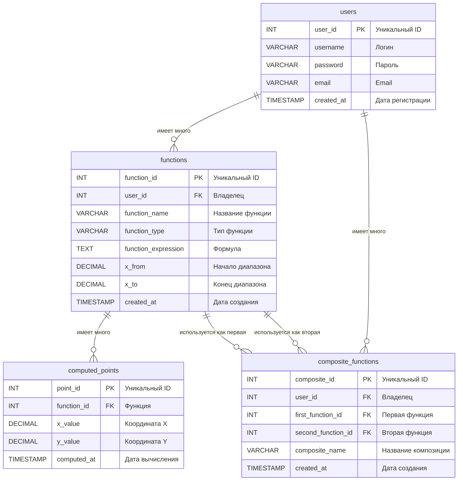

# Лабораторные работы по ООП  

Лабораторные работы по объектно-ориентированному программированию на Java.

**Университет:** [Самарский университет](https://ssau.ru/)  
**Язык:** Java  
**Темы:** Функции, интерфейсы, наследование, коллекции, многопоточность  
**Содержание:**

- [Отчеты и таблицы](#отчеты-и-таблицы-)
- [Схемы и диаграммы](#схемы-и-диаграммы-)
- [Документация](#документация-)


## Отчеты и таблицы 

### Сравнение производительности
| Операция | [Manual](../../tree/manual) | [Framework](../../tree/framework) | Разница | Ускорение | Операций |
|----------|--------|-----------|-----------|-----------|----------|
| **CREATE** | 4630 ms | 436 ms | -4194 ms | **x10.5**  | *10k* |
| **READ** | 650 ms | 559 ms | -91 ms | **x1.16** | *10k* |
| **UPDATE** | 3945 ms | 91 ms | -3854 ms | **x43**  | *10k* |
| **DELETE** | 5794 ms | 76 ms | -5718 ms | **x76**  | *10k* |
| **SEARCH** | 10302 ms | 6823 ms | -3479 ms | **x1.5** | *1k* |


### Сравнение производительности сортировки
| Операция сортировки | [Manual](../../tree/manual) | [Framework](../../tree/framework) | Разница | Ускорение | Записей |
|---------------------|-------------|-----------|---------|---------|---------|
| Сортировка по имени | 55 ms | 47 ms | -8 ms | **x1.17** | *10k* |
| Сортировка по типу и имени | 54 ms | 14 ms | -40 ms | **x3.85**  | *10k* |


<br>

### Отчет о тестовом покрытии

#### Overall Coverage Summary
| Package | Class | Method | Branch | Line |
|---------|-------|--------|--------|------|
| **all classes** |  100% (56/56)  | 100% (218/218)  | 100% (250/250)  | <ins>98.1% (728/742)</ins>  |

#### Coverage Breakdown
| Package | Class | Method | Branch | Line |
|---------|-------|--------|--------|------|
| **concurrent** | 100% (9/9)  | 100% (30/30)  | 100% (26/26)  | <ins>99% (101/102)</ins>  |
| **exceptions** | 100% (4/4)  | 100% (8/8)  | - | 100% (8/8)  |
| **functions** | 100% (18/18)  | 100% (103/103)  | 100% (184/184)  | 100% (339/339)  |
| **functions.factory** | 100% (3/3)  | 100% (7/7)  | - | 100% (7/7)  |
| **io** | 100% (9/9)  | 100% (31/31)  | 100% (14/14)  | <ins>93.8% (195/208)</ins>  |
| **operations** | 100% (13/13)  | 100% (39/39)  | 100% (26/26)  | 100% (78/78)  |

*Generated on 2025-10-19*


<br>

### Итоговая производительность API
| Запрос к конечной точке API | [Manual](../../tree/manual) среднее время (мс) | [Framework](../../tree/framework) среднее время (мс) | Преимущество [Framework](../../tree/framework) |
|----------------|-----------------|--------------------|------------------|
| Add Functions | 12 | 8 | x1.50 |
| Calculate Function Value | 8 | 11 | <ins>x0.73</ins>  |
| Create Composite Function | 58 | 26 | **x2.23**  |
| Create Function | 53 | 25 | **x2.12**  |
| Create Point | 15 | 24 | <ins>x0.62</ins>   |
| Create User | 62 | 45 | x1.38 |
| Delete Composite Function | 40 | 10 | **x4.00**  |
| Delete Function | 52 | 33 | x1.58 |
| Delete Point | 18 | 12 | x1.50 |
| Delete User | 46 | 26 | x1.77 |
| Differentiate Function - LEFT | 11 | 11 | <ins>x1.00</ins>  |
| Differentiate Function - MIDDLE | 10 | 12 | <ins>x0.83</ins>  |
| Differentiate Function - RIGHT | 12 | 11 | x1.09 |
| Divide Functions | 13 | 8 | x1.62 |
| Get All Functions | 44 | 9 | **x4.89**  |
| Get All Users | 88 | 12 | **x7.33**  |
| Get Composite Function By ID | 40 | 8 | **x5.00**  |
| Get Composite Functions By User ID | 38 | 10 | **x3.80**  |
| Get Function By ID | 43 | 9 | **x4.78**  |
| Get Functions By User ID | 40 | 12 | **x3.33**  |
| Get Functions Sorted by Name ASC | 70 | 7 | **x10.00**  |
| Get Functions Sorted by Name DESC | 46 | 8 | **x5.75**  |
| Get Functions Sorted by Type and Name | 52 | 8 | **x6.50**  |
| Get Functions Sorted by X From ASC | 43 | 8 | **x5.38**  |
| Get Point By ID | 41 | 9 | **x4.56**  |
| Get Points By Function ID | 39 | 9 | **x4.33**  |
| Get User By ID | 55 | 8 | **x6.88**  |
| Multiply Functions | 14 | 8 | x1.75 |
| Search Functions - Deep | 41 | 8 | **x5.12**  |
| Search Functions - Quick | 57 | 9 | **x6.33**  |
| Subtract Functions | 11 | 8 | **x1.38**  |
| Update Composite Function | 46 | 19 | **x2.42**  |
| Update Function | 38 | 21 | x1.81 |
| Update Point | 25 | 12 | **x2.08**  |
| Update User | 52 | 15 | **x3.47**  |


<br>

## Схемы и диаграммы 

### ER диаграмма


### Файлы диаграмм
- Entity-relationship diagram - [ER.puml](ER.puml) 
- Sequence diagram for authentication - [SD_AUTH.puml](SD_AUTH.puml) 
- Sequence diagram for calculations - [SD_CACL.puml](SD_CACL.puml) 


<br>

## Документация 


### Единый API контракт  
Для обоих веток реализации - [Framework](../../tree/framework) и [Manual](../../tree/manual).

| Конечная точка | Описание |
|----------------|----------|
| `/api/auth/register`  | Создать пользователя (без ролей). |
| `/api/auth/assign-roles`  | Выдать роли существующему пользователю. |
| `/api/users`  | Список пользователей. |
| `/api/users/{id}`  | Прочитать, обновить или удалить конкретного пользователя. |
| `/api/users/{id}/functions`  | Получить функции владельца. |
| `/api/users/{id}/composite-functions`  | Получить составные функции владельца. |
| `/api/functions`  | Список функций (поддерживает сортировку) и создание. |
| `/api/functions/{id}`  | Работа с конкретной функцией. |
| `/api/functions/{id}/calculate`  | Посчитать значение функции по точке. |
| `/api/functions/{id}/differentiate`  | Посчитать производную (тип передаётся параметром). |
| `/api/functions/{id}/points`  | Список точек функции / создание точки. |
| `/api/functions/operations`  | Сложение/вычитание/умножение/деление табличных функций. |
| `/api/functions/search`  | Поиск функций по тексту, сортировка, пагинация. |
| `/api/composite-functions`  | Список и создание составных функций. |
| `/api/composite-functions/{id}`  | CRUD по конкретной составной функции. |
| `/api/points/{id}`  | Работа с конкретной точкой. |
| `/api/roles`  | Список ролей и создание новой. |
| `/api/roles/{id}`  | Работа с конкретной ролью. |

#### API
- Базовый URL: http://localhost:8080.
- Авторизация: логин + пароль пользователя, созданного через `/api/auth/register` + `/api/auth/assign-roles`.
- Основные ресурсы: `/api/auth`, `/api/users`, `/api/functions`, `/api/points`, `/api/composite-functions`, `/api/roles`.

<br>

### Предварительные требования 
- Java 17 и Maven 3.9+.
- PostgreSQL 16.1+.
- Docker Desktop и Git.
- Node.js 18+ и Newman: `npm install -g newman`.

#### Дополнительные требования для [Manual](../../tree/manual):
- Tomcat: apache-tomcat-9.0.112.


<br>

### Установка и запуск  
1. **Клонирование репозитория:**

   ```bash
   git clone https://github.com/barinovadn/labs-OOP
   cd labs-OOP
   ```
2. **Выбор ветки:**
   
   Выберите одну из реализаций:
   ```bash
   git checkout manual # Servlets & Tomcat
   ```
   ```bash
   git checkout framework # Spring Boot
   ```
3. **Сборка и запуск:**

   Откройте PowerShell в корне репозитория и выполните:
   ```powershell
   .\docker-run.ps1
   ```
   Скрипт автоматически соберет и запустит проект в Docker контейнере.<br>

4. **Проверка:**

   В том же окне:
   ```powershell
   .\docker-test.ps1
   ```
   Или по http://localhost:8080/api/users - `admin` `admin`.


<br>

### Тесты  
- [docker-test.ps1](../manual/docker-test.ps1) | [docker-test.ps1](../framework/docker-test.ps1) - Упрощенные API тесты.
- [src/test/postman](src/test/postman/) - Newman тесты.
    - [run-tests.ps1](../manual/src/test/postman/run-tests.ps1) | [run-tests.ps1](../framework/src/test/postman/run-tests.ps1) - Основные API тесты.
    - [run-performance.ps1](../manual/src/test/postman/run-performance.ps1) | [run-performance.ps1](../framework/src/test/postman/run-performance.ps1) - Тесты для проверки. производительности, [таблица сравнения](#итоговая-производительность-api).
    - [/results/](src/test/postman/results/) - Подробные результаты Newman тестов.
- [src/test/java](src/test/java/) - Java тесты.

### Дополнительно
- Результаты производительности для каждой ветки сохраняются в [src/test/postman/results/PERFORMANCE_RESULTS.md](../manual/src/test/postman/results/PERFORMANCE_RESULTS.md).


<br>

 
