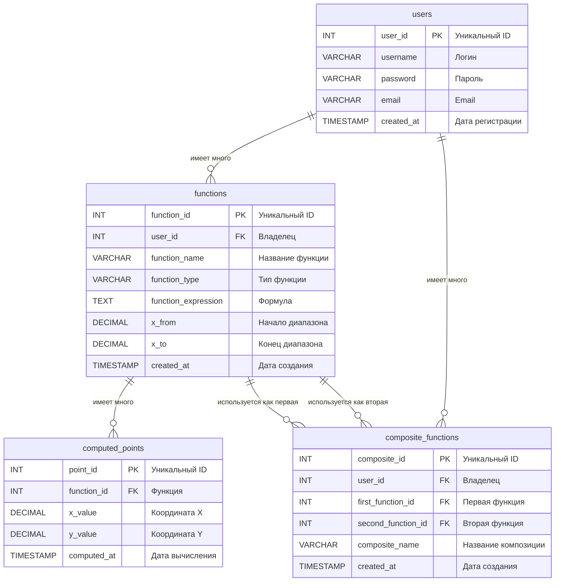

# Лабораторные работы по ООП  

Лабораторные работы по объектно-ориентированному программированию на Java.

**Университет:** [Самарский университет](https://ssau.ru/)  
**Язык:** Java  
**Темы:** Функции, интерфейсы, наследование, коллекции, многопоточность  
**Содержание:**

- [Отчеты и таблицы](#отчеты-и-таблицы)
- [Схемы и диаграммы](#схемы-и-диаграммы)
- [Документация](#документация)

 

## Отчеты и таблицы

### Сравнение производительности

| Операция | [Manual](../../tree/manual) | [Framework](../../tree/framework) | Разница | Ускорение | Операций |
|----------|--------|-----------|-----------|-----------|----------|
| **CREATE** | 4630 ms | 436 ms | -4194 ms | **x10.5**  | *10k* |
| **READ** | 650 ms | 559 ms | -91 ms | **x1.16** | *10k* |
| **UPDATE** | 3945 ms | 91 ms | -3854 ms | **x43**  | *10k* |
| **DELETE** | 5794 ms | 76 ms | -5718 ms | **x76**  | *10k* |
| **SEARCH** | 10302 ms | 6823 ms | -3479 ms | **x1.5** | *1k* |

### Сравнение производительности сортировки

| Операция сортировки | [Manual](../../tree/manual) | [Framework](../../tree/framework) | Разница | Ускорение | Записей |
|---------------------|-------------|-----------|---------|---------|---------|
| Сортировка по имени | 55 ms | 47 ms | -8 ms | **x1.17** | *10k* |
| Сортировка по типу и имени | 54 ms | 14 ms | -40 ms | **x3.85**  | *10k* |

 

### Отчет о тестовом покрытии

#### Overall Coverage Summary
| Package | Class | Method | Branch | Line |
|---------|-------|--------|--------|------|
| all classes |  100% (56/56)  | 100% (218/218)  | 100% (250/250)  | <ins>98.1% (728/742)</ins>  |

#### Coverage Breakdown

| Package | Class | Method | Branch | Line |
|---------|-------|--------|--------|------|
| **concurrent** | 100% (9/9) | 100% (30/30) | 100% (26/26) | <ins>99% (101/102)</ins> |
| **exceptions** | 100% (4/4) | 100% (8/8) | - | 100% (8/8) |
| **functions** | 100% (18/18) | 100% (103/103) | 100% (184/184) | 100% (339/339) |
| **functions.factory** | 100% (3/3) | 100% (7/7) | - | 100% (7/7) |
| **io** | 100% (9/9) | 100% (31/31) | 100% (14/14) | <ins>93.8% (195/208)</ins> |
| **operations** | 100% (13/13) | 100% (39/39) | 100% (26/26) | 100% (78/78) |

*Generated on 2025-10-19*

 

### Итоговая производительность API

| Запрос к конечной точке API | [Manual](../../tree/manual) среднее время (мс) | [Framework](../../tree/framework) среднее время (мс) | Преимущество [Framework](../../tree/framework) |
|----------------|-----------------|--------------------|------------------|
| Add Functions | 12 | 8 | x1.50 |
| Calculate Function Value | 8 | 11 | <ins>x0.73</ins>  |
| Create Composite Function | 58 | 26 | **x2.23** |
| Create Function | 53 | 25 | **x2.12** |
| Create Point | 15 | 24 | <ins>x0.62</ins>  |
| Create User | 62 | 45 | x1.38 |
| Delete Composite Function | 40 | 10 | **x4.00**  |
| Delete Function | 52 | 33 | x1.58 |
| Delete Point | 18 | 12 | x1.50 |
| Delete User | 46 | 26 | x1.77 |
| Differentiate Function - LEFT | 11 | 11 | <ins>x1.00</ins>  |
| Differentiate Function - MIDDLE | 10 | 12 | <ins>x0.83</ins>  |
| Differentiate Function - RIGHT | 12 | 11 | x1.09 |
| Divide Functions | 13 | 8 | x1.62 |
| Get All Functions | 44 | 9 | **x4.89**  |
| Get All Users | 88 | 12 | **x7.33**  |
| Get Composite Function By ID | 40 | 8 | **x5.00**  |
| Get Composite Functions By User ID | 38 | 10 | **x3.80** |
| Get Function By ID | 43 | 9 | **x4.78**  |
| Get Functions By User ID | 40 | 12 | **x3.33** |
| Get Functions Sorted by Name ASC | 70 | 7 | **x10.00**  |
| Get Functions Sorted by Name DESC | 46 | 8 | **x5.75**  |
| Get Functions Sorted by Type and Name | 52 | 8 | **x6.50**  |
| Get Functions Sorted by X From ASC | 43 | 8 | **x5.38**  |
| Get Point By ID | 41 | 9 | **x4.56**  |
| Get Points By Function ID | 39 | 9 | **x4.33**  |
| Get User By ID | 55 | 8 | **x6.88**  |
| Multiply Functions | 14 | 8 | x1.75 |
| Search Functions - Deep | 41 | 8 | **x5.12**  |
| Search Functions - Quick | 57 | 9 | **x6.33**  |
| Subtract Functions | 11 | 8 | **x1.38** |
| Update Composite Function | 46 | 19 | **x2.42** |
| Update Function | 38 | 21 | x1.81 |
| Update Point | 25 | 12 | **x2.08** |
| Update User | 52 | 15 | **x3.47** |

 

## Схемы и диаграммы

### ER диаграмма

### Файлы диаграмм

- Entity-relationship diagram - [ER.puml](ER.puml)
- Sequence diagram for authentication - [SD_AUTH.puml](SD_AUTH.puml)
- Sequence diagram for calculations - [SD_CACL.puml](SD_CACL.puml)

 

## Документация 

    . . .

 

 
