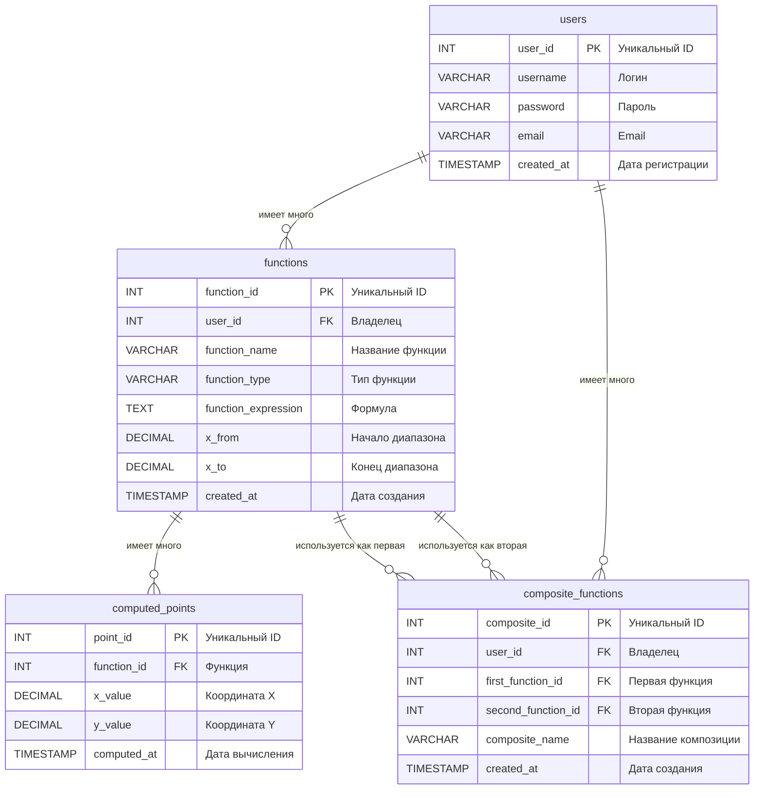

# Лабораторные работы по ООП  

Лабораторные работы по объектно-ориентированному программированию на Java.

**Университет:** [Самарский университет](https://ssau.ru/)  
**Язык:** Java  
**Темы:** функции, интерфейсы, наследование, коллекции, многопоточность, синхронизация  

 

### Сравнение производительности

| Операция | [Manual](../../tree/manual) | [Framework](../../tree/framework) | Разница | Ускорение | Операций |
|----------|--------|-----------|-----------|-----------|----------|
| **CREATE** | 4630 ms | 436 ms | -4194 ms | **x10.5**  | *10k* |
| **READ** | 650 ms | 559 ms | -91 ms | **x1.16** | *10k* |
| **UPDATE** | 3945 ms | 91 ms | -3854 ms | **x43**  | *10k* |
| **DELETE** | 5794 ms | 76 ms | -5718 ms | **x76**  | *10k* |
| **SEARCH** | 10302 ms | 6823 ms | -3479 ms | **x1.5** | *1k* |

### Сравнение производительности сортировки

| Операция сортировки | [Manual](../../tree/manual) | [Framework](../../tree/framework) | Разница | Ускорение | Записей |
|---------------------|-------------|-----------|---------|---------|---------|
| Сортировка по имени | 55 ms | 47 ms | -8 ms | **x1.17** | *10k* |
| Сортировка по типу и имени | 54 ms | 14 ms | -40 ms | **x3.85**  | *10k* |

 

### Отчет о тестовом покрытии

#### Overall Coverage Summary
| Package | Class | Method | Branch | Line |
|---------|-------|--------|--------|------|
| all classes |  100% (56/56)  | 100% (218/218)  | 100% (250/250)  | <ins>98.1% (728/742)</ins>   |

#### Coverage Breakdown
| Package | Class | Method | Branch | Line |
|---------|-------|--------|--------|------|
| **concurrent** | 100% (9/9) | 100% (30/30) | 100% (26/26) | <ins>99% (101/102)</ins> |
| **exceptions** | 100% (4/4) | 100% (8/8) | - | 100% (8/8) |
| **functions** | 100% (18/18) | 100% (103/103) | 100% (184/184) | 100% (339/339) |
| **functions.factory** | 100% (3/3) | 100% (7/7) | - | 100% (7/7) |
| **io** | 100% (9/9) | 100% (31/31) | 100% (14/14) | <ins>93.8% (195/208)</ins> |
| **operations** | 100% (13/13) | 100% (39/39) | 100% (26/26) | 100% (78/78) |

*Generated on 2025-10-19*

 

### ER диаграмма

 

 
