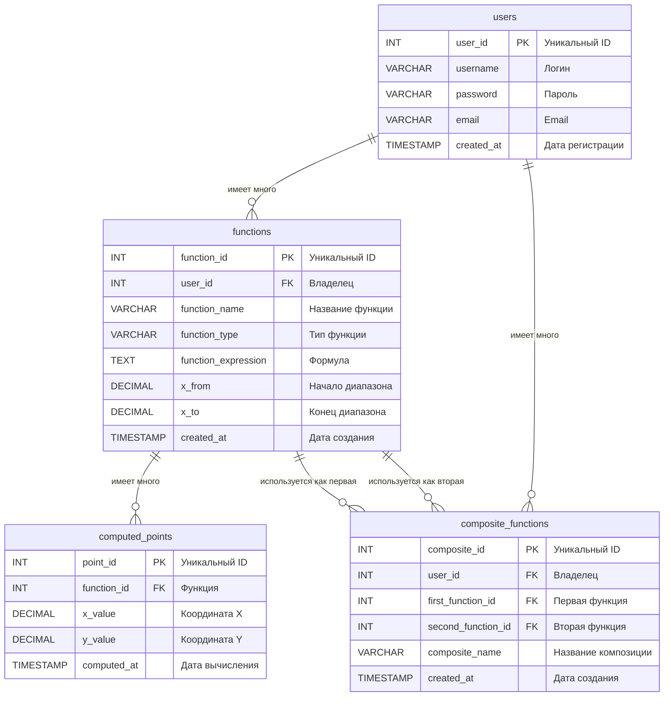

# Лабораторные работы по ООП

Лабораторные работы по объектно-ориентированному программированию на Java.

**Университет:** [Самарский университет](https://ssau.ru/)   
**Язык:** Java  
**Темы:** функции, интерфейсы, наследование, коллекции, многопоточность, синхронизация

### ER диаграмма

### Отчет о тестовом покрытии

#### Overall Coverage Summary
| Package | Class | Method | Branch | Line |
|---------|-------|--------|--------|------|
| all classes | 100% (56/56) | 100% (218/218) | 100% (250/250) | 98.1% (728/742) |

#### Coverage Breakdown
| Package | Class | Method | Branch | Line |
|---------|-------|--------|--------|------|
| **concurrent** | 100% (9/9) | 100% (30/30) | 100% (26/26) | 99% (101/102) |
| **exceptions** | 100% (4/4) | 100% (8/8) | - | 100% (8/8) |
| **functions** | 100% (18/18) | 100% (103/103) | 100% (184/184) | 100% (339/339) |
| **functions.factory** | 100% (3/3) | 100% (7/7) | - | 100% (7/7) |
| **io** | 100% (9/9) | 100% (31/31) | 100% (14/14) | 93.8% (195/208) |
| **operations** | 100% (13/13) | 100% (39/39) | 100% (26/26) | 100% (78/78) |

*Generated on 2025-10-19*
 

 
